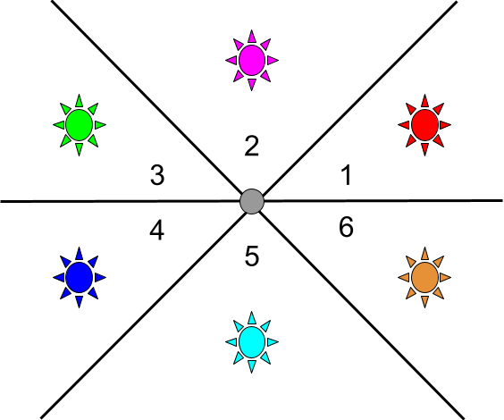

# Cyclical Dance
> An Arduino-enabled augmented instrument setup

## Usage

### General Use


> Positions around the magnet that can be used to enable different effects and sounds through supercollider. The colors correspond to the color of the on-board LED in that position.

Once everything is set up (see [Setting up](#setting-up)), move the Arduino to any of the six positions around the magnet to enable the corresponding effect. Positioning the Arduino very close to the magnet will reset the effects (and the LED will turn off) - you will have two seconds to move your foot either to a new effect area or far away from the magnet.

## Prerequisites

### Hardware

- Arduino Nano 33 BLE Sense
- computer with Linux or Windows 10
- BLE dongle or embedded Bluetooth 5 (eg on laptops)
- Strong magnet(s)


### Software

- Supercollider
- Arduino IDE
- Python 3.9+

Install the following libraries on Arduino IDE

- Arduino Nano 33 BLE boards
- ArduinoBLE
- Arduino_LSM9DS1

You also need these Python libraries:

```py
pip3 install pygatt bleak python-osc
```

or

```py
pip install pygatt bleak python-osc
```

## Setting up
- Connect your Arduino Nano 33 BLE Sense to a computer with the Arduino IDE installed
- Open the serial monitor on Arduino IDE
- Note the mac address of the Arduino (it will be printed in the serial monitor)
- Set it in the variable `MAC_ADDR` located in the `controller/main.py` file
- Open Supercollider. Check the console output for the port number, set it in the `__init__` function in the file `controller/supercollider.py`
- Run the python script:

```py
cd controller
python main.py
```

### Connecting the Python script to the Arduino

- Move your Arduino close to the magnet, and move it around the magnet but not too close. The on-board LEDs should be changing colors. 
- The Python script will output a connection message once it connects to the Arduino.
- You are now ready to dance